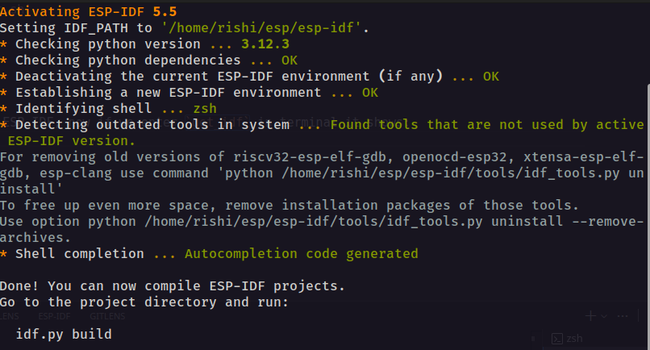

+++
date = '2025-11-07T23:17:28+05:30'
draft = false
title = 'ESP32 Emulation from Scratch using QEMU'
toc = true
+++
## OS Config (my pc)
- OS      : Ubuntu 24.04.3 LTS (6.14.0-34-generic)
- CPU     : 12th Gen Intel(R) Core(TM) i7-12650H (x86_64)
- Mem     : 31.0 GiB
- GPU     : NVIDIA GeForce RTX 3050 Mobile

## Software Config
The installation of these are listed below
- QEMU emulator version 8.2.2

## Step 1: Installing Prerequisites
### QEMU
- I started with downloading **QEMU**, as my system is Ubuntu, im using apt repositories to download the resources \
  hence you can download QUMU packages from:  [https://www.qemu.org/download/#linux](https://www.qemu.org/download/#linux) \
  or remove the `#linux` trailing to get downloads for multiple Os-es
- now you can **verifiy** it by typing 
  ```bash
     qemu-system-x86_64 --version
  ```
- in the terminal which gives the output: 
  ```bash
  QEMU emulator version 8.2.2 (Debian 1:8.2.2+ds-0ubuntu1.10)
  Copyright (c) 2003-2023 Fabrice Bellard and the QEMU Project developers 
  ```

### ESP-IDF
The ESP IDF come in many versions, like latest and stable, i have gone with stable and will be using the stable version for the entire process, documentation is pretty easy to follow and install and you can find it at 
[ESP-IDF Installation](https://docs.espressif.com/projects/esp-idf/en/stable/esp32/get-started/index.html#manual-installation) 

for Ubuntu/Debian users, i have copied an Excerpt for installaing ESP-IDF in Linux systems below or continue from [here](https://docs.espressif.com/projects/esp-idf/en/stable/esp32/get-started/linux-macos-setup.html#installing-python-3) or Ubuntu/Debian users can follow the instructions below
#### ESP-IDF installation **for GNU/Linux users**
To compile using ESP-IDF, you need to get the following packages. The command to run depends on which distribution of Linux you are using: \
**Prerequisites**  
basically downloading and installing the prerequisites: 
```bash
sudo apt-get install git wget flex bison gperf python3 python3-pip python3-venv cmake ninja-build ccache libffi-dev libssl-dev dfu-util libusb-1.0-0 
```
**Installing Python**  
now checking python 3
```bash
python3 --version
```
if this shows an output like
```bash
Python 3.12.3
```
you are good to go ! or else download python, now lets get started with the ESP-IDF installation \
**Getting ESP-IDF**  
To build applications for the ESP32, you need the software libraries provided by Espressif in ESP-IDF repository. \
To get ESP-IDF, navigate to your installation directory and clone the repository with git clone, following instructions below specific to your operating system.

```bash
mkdir -p ~/esp
cd ~/esp
git clone -b v5.5.1 --recursive https://github.com/espressif/esp-idf.git
```
**Setting up ESP-IDF**  
Aside from the ESP-IDF, you also need to install the tools used by ESP-IDF, such as the compiler, debugger, Python packages, etc, for projects supporting ESP32.
```bash
cd ~/esp/esp-idf
./install.sh esp32
```
**Set up the Environment Variables**
In the terminal where you are going to use ESP-IDF, run:
```bash
. $HOME/esp/esp-idf/export.sh
```
> Note the space between the leading dot and the path! \

**Extras(Really usefull)** \
now we need to add this idf.py to the PATH so that we can acces it from anywhere \
Copy and paste the following command to your shell's profile (.profile, .bashrc, .zprofile, etc.), usually its .bashrc
```bash
alias get_idf='. $HOME/esp/esp-idf/export.sh'
```

then do 
```bash
source .bashrc
```
Yay we downloaded and installed QEMU and ESP-IDF, now if we enter `get_idf` in terminal it shows:
